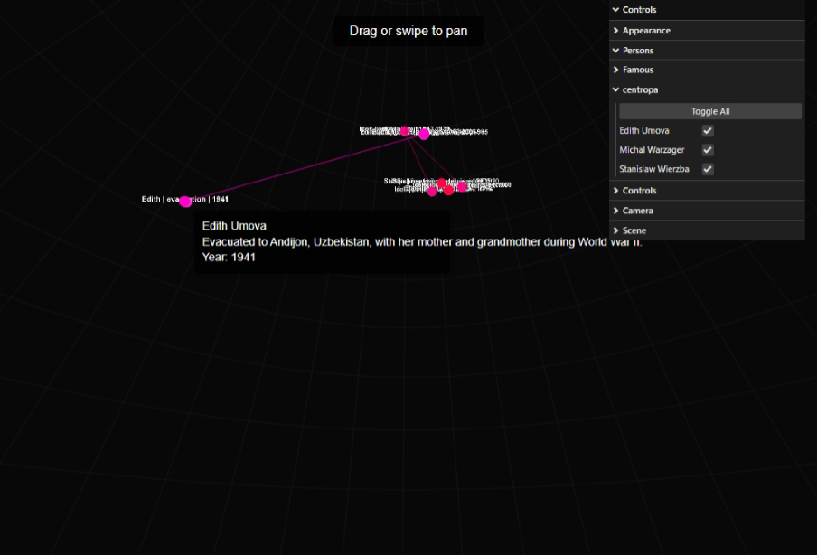

# PersonStallations: Interactive Biography Visualization

An interactive 3D visualization tool that depicts biographies through a celestial interface, with a special focus on Holocaust survivors from Centropa's archive.

## Overview

PersonStallations transforms biographical data into an immersive 3D star map, where each star represents a significant moment in a person's life. The project currently features:

- Holocaust survivors' stories from Centropa's archive
- Interactive timeline navigation
- Dynamic star visualization
- Category-based filtering
- Intuitive touch and mouse controls

## Documentation

- [Project Motivation](docs/motivation.md)
- [Artist Portfolio](docs/portfolio.md)

## Project Goals

The primary goal is to create meaningful 3D artworks that commemorate and share the stories of Holocaust survivors from Centropa's archive. These artworks will be:

1. Featured in the MemoryLanes app
2. Integrated into digital spaces for broader engagement
3. Accessible through an interactive interface

## Technical Implementation

The visualization is built using:
- Three.js for 3D rendering
- Custom star visualization system
- Timeline-based navigation
- Category-based filtering system
- Touch and mouse input support

## Future Integration

The artworks created through this project will be integrated into the MemoryLanes app, providing:
- Interactive user experiences
- Digital space integration
- Broader community engagement
- Educational opportunities

## Participation

Artists and creators interested in contributing to this project are welcome. While prior AR experience is beneficial, it is not required. Selected participants will receive support from AR professionals throughout the project development process.

## Getting Started

The visualization can be accessed through a web browser. Users can:
- Navigate through time using the timeline controls
- Filter biographies by category
- Interact with individual story points
- Explore the 3D space using touch or mouse controls

