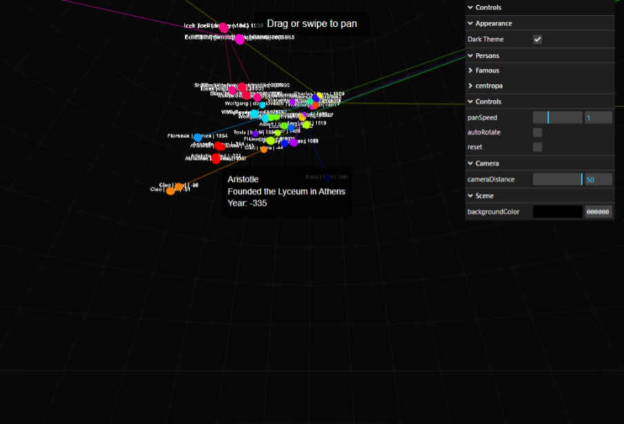

## Motivational letter

Experience the live visualization at: https://dmytrove.github.io/PersonStellations/

I am committed to transforming the written biographies from Centropa.org into immersive 3D artworks to be showcased in the MemoryLanes app under the PersonStallations project. My vision is to reimagine these powerful narratives as interactive celestial maps, where each star embodies a significant moment in a survivor's life. Inspired by Stellarium's star maps and the Stellarium app, my project employs advanced 3D rendering techniques with Three.js to create dynamic star visualizations. In augmented reality, users can move their cameras to see where significant events occurred, and tapping on individual stars will reveal detailed information about each moment.

Drawing on my heritage from Dnipro and my deep awareness of the Holocaust, this project is profoundly personal. I have witnessed firsthand how the memory of these events resonates within local communities, where many friends and neighbors carry these legacies. Moreover, the ongoing war with Russia touches me deeply, as it directly impacts my homeland and those I hold dear.

I am motivated by the belief that art can serve as a vital connector between history and personal experience—a tool for healing, reflection, and community engagement. Through this project, I aim to create a digital space where memory and storytelling unite, empowering viewers to explore and honor significant lives in an innovative, interactive format.